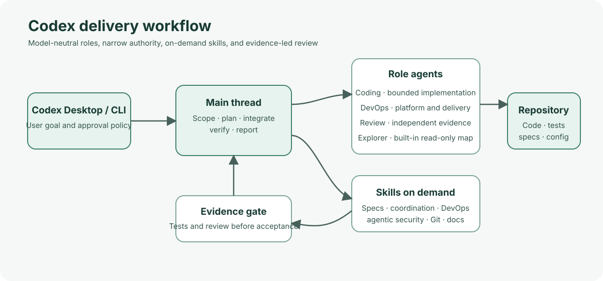

# Codex Delivery Team

A model-neutral Codex setup for software delivery, platform operations, and independent review. It includes project-local agent roles, an optional repo plugin, reusable skills, hooks, shell rules, and spec templates.

> This is a sample configuration, not a security boundary or production control plane. Review its agents, plugin, hooks, rules, and approval policy before adopting it.

## Roles

| Role | Use |
| --- | --- |
| Main Codex thread | Owns user communication, scope, decisions, integration, and final verification. |
| fullstack-agent | Plans substantial work, breaks it into bounded tasks, coordinates workers, and consolidates evidence. |
| coding-agent | Implements scoped application, test, and tooling changes. |
| devops-agent | Handles platform architecture, infrastructure, CI/CD, containers, deployment, reliability, security, observability, performance, cost, and runbooks. |
| review-agent | Independently checks correctness, security, regressions, and verification evidence. |

Codex's built-in explorer role is useful for broad, read-only codebase mapping. It gathers evidence; it does not implement changes or replace the independent reviewer.

The main thread should remain the coordinator for ordinary work. Use a role agent when specialization, parallel work, or independent review materially helps. Keep concurrent tasks file-disjoint. The project setting caps spawned agents at eight concurrent threads; role prompts describe smaller practical pools.

## Quick Start

1. Open this repository in ChatGPT desktop and trust the project only after reviewing its local configuration.
2. Restart the desktop app after changing a repo marketplace. Open the Plugins Directory, choose the Sample Codex Agent Team marketplace, and install Codex Agent Team.
3. Start a new Codex thread after installing the plugin or changing custom agent files so the updated instructions are discovered.
4. Begin with a bounded prompt such as:

    Use the Codex team to plan this change. Create a spec under .codex/specs, split implementation into file-disjoint scopes, and run an independent review.

For the CLI, add the repo marketplace with:

    codex plugin marketplace add /absolute/path/to/this/repository

Then use the CLI plugin interface. The ChatGPT desktop app uses the Plugins Directory. In Codex, skills appear in the composer and slash-command list; invoke workflows with $team-brainstorm, $team-spec-workflow, or $optimize-my-codex.

The plugin contains on-demand workflow skills. It does not require an external plugin, MCP server, credential, provider, or account to run the core workflow.

## Model-Neutral Configuration

Agent profiles in .codex/agents define the required name, description, and developer instructions. They intentionally omit model and reasoning overrides, allowing Codex to use the current app or session selection. Project configuration sets only the current concurrent-thread limit and enables the local team plugin. It contains no model, provider, or credential settings.

Use current Codex settings rather than copying a model matrix into agent TOML files. Codex's built-in roles include default, worker, and explorer; use explorer for read-heavy mapping and keep custom roles narrow.

## Workflow

1. Capture user goals and constraints in .codex/specs/<slug>/requirements.md.
2. Record design, exact interfaces, and alternatives in design.md and spec.md.
3. Split work into small tasks with clear acceptance checks, file scopes, and durable task-group identifiers.
4. Delegate only file-disjoint work. Keep external writes, live changes, deployment, and destructive actions behind explicit approval.
5. Verify each result with checks that actually exercise the claimed behavior.
6. Use review-agent for an independent, adversarial review. Each task group has a separate, non-resetting maximum of three review cycles; cycle 3 is terminal.

Specs created during project work are runtime artifacts and are ignored by Git. The templates live in docs/specs/templates.

## Skills

| Skill | Purpose |
| --- | --- |
| team-brainstorm | Turn a rough idea into requirements and open questions. |
| team-spec-workflow | Create specs, task waves, decisions, and completion criteria. |
| team-coordination | Define precise agent roles, scopes, handoffs, and liveness checks. |
| team-review-cycle | Run bounded, evidence-based independent reviews. |
| team-documentation | Keep user and operator documentation aligned with actual behavior. |
| agentic-security-review | Threat-model agent tools, authority, context, memory, and inter-agent handoffs. |
| concurrent-cached-fetch | Bound concurrency and cache independent external fetches. |
| git-workflow | Prepare branches and changes with non-interactive Git practices. |
| optimize-my-codex | Audit Codex configuration and prepare a behavior-preserving migration. |

Skills load on demand. Their descriptions should stay short and state when to use them; detailed procedure belongs in the skill file.

## Agentic Security

When software grants agents tools, credentials, persistent context, or the ability to change external state, apply the relevant threats from the OWASP Top 10 for Agentic Applications. Consider the OWASP Agent Control Standard for runtime policy enforcement, observability, and traceability where the selected framework supports it. The workflow emphasizes least privilege, explicit approval for consequential actions, input and output validation, narrow delegation, bounded retries, privacy-aware logs, and independent review.

NIST's AI Agent Standards Initiative is evolving work. This repo does not claim conformance or certification; use established identity, authorization, secure-development, and risk-management controls, and track standards updates. See SECURITY.md for the threat model and sources.

## Plugin And Marketplace

The local marketplace catalog is .agents/plugins/marketplace.json. The plugin package is under plugins/codex-agent-team, with a portable root plugin.json and on-demand skills. Project-local Codex configuration is under .codex/.

For an optional personal-marketplace install, use:

    python3 scripts/install_personal_plugin.py --refresh-cache

Review the script before running it; it updates local Codex plugin configuration and links the plugin into the personal marketplace.

## Hooks And Rules

Project hooks are wired in .codex/hooks.json and implemented in .codex/hooks. They log filtered session and subagent lifecycle metadata, honor CODEX_HOME, rotate logs, and fail open. They execute locally with the user's privileges after project trust, so inspect them before enabling.

Rules in .codex/rules/codex-agent-team.rules add prompts or denials around selected commands that can rewrite history, remove resources, alter infrastructure, or change a cluster. Rules complement Codex permissions; they do not replace sandboxing or review.

## Validation

Run the checks from the repository root:

    python3 scripts/test_prompt_invariants.py -v
    python3 .codex/hooks/test_session_start.py -v
    python3 .codex/hooks/test_subagent_lifecycle.py -v
    python3 -m py_compile .codex/hooks/session_start.py .codex/hooks/subagent_lifecycle.py
    python3 -m json.tool .codex/hooks.json
    python3 -m json.tool .agents/plugins/marketplace.json
    python3 -m json.tool plugins/codex-agent-team/plugin.json
    python3 scripts/install_personal_plugin.py --dry-run
    python3 -c "import pathlib, tomllib; files=[pathlib.Path('.codex/config.toml'), *pathlib.Path('.codex/agents').glob('*.toml')]; [tomllib.loads(p.read_text()) for p in files]"

The invariant suite checks that agent files have no model or provider pins, requested roles and plugin skills exist, docs cross-reference current names, risky source terms are absent, and manifests parse. Hook tests cover filtering, custom Codex home, malformed input, fail-open behavior, rotation, and concurrent writes.

A parser check does not prove that Codex accepts or activates every project setting. Review and trust local configuration in the target app, then open a fresh thread. Treat live deployment checks as open until they are safely run against an approved environment.

## Layout

    .agents/plugins/marketplace.json       Local plugin catalog
    .codex/agents/                         Custom role profiles
    .codex/config.toml                      Project concurrency and plugin enablement
    .codex/hooks.json                       Lifecycle hook wiring
    .codex/hooks/                           Fail-open local loggers and tests
    .codex/rules/                           Shell command safety prompts
    plugins/codex-agent-team/plugin.json    Portable plugin manifest
    plugins/codex-agent-team/skills/        On-demand workflow skills
    docs/specs/templates/                  Starting points for project specs
    scripts/                               Installer and repository checks

## Further Reading

- Agent definitions and project conventions: AGENTS.md
- Threat model and agentic security baseline: SECURITY.md
- Architecture and configuration boundaries: docs/design.md
- Current Codex subagents: https://learn.chatgpt.com/docs/agent-configuration/subagents
- Local plugin marketplaces: https://developers.openai.com/plugins/build/plugins
- OWASP agentic threat taxonomy: https://genai.owasp.org/resource/owasp-top-10-for-agentic-applications-for-2026/
